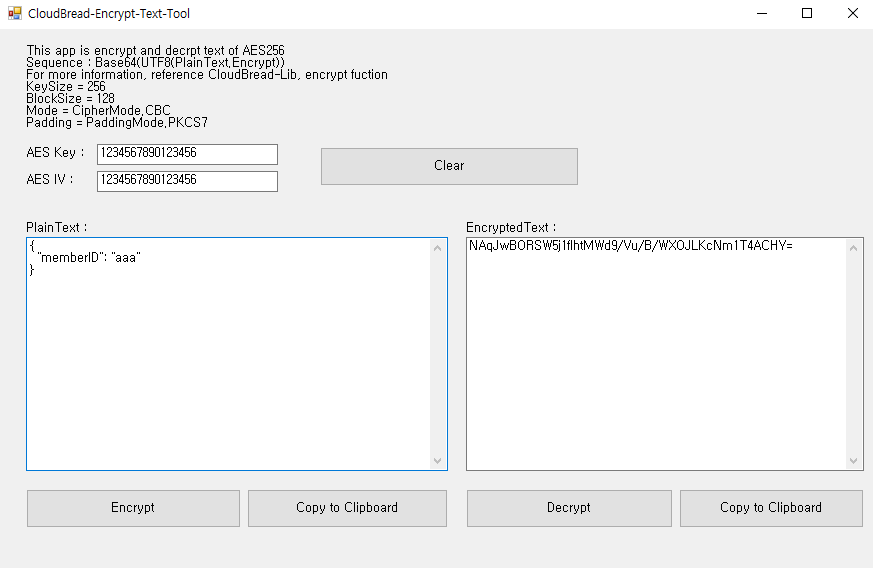

# CloudBread-Encrypt-Text-Tool
This repo is CloudBread Encryption Development Tool

This project is Encryption test tool for CloudBread. You can encrypt and decrypt AES256 data with **Postman** request/response on development.

###Install guide
This projet is build for Visual Studio 2015 - Windows Form porject. Download and open **sln** file in your Visual Studio and execure it.

###Usage guide
To Encryption,
- Paste plain text on "PlainText" texebox and click "Encrypt" button.
- Confirm the Encrypted Text on "EncryptedText" textbox and click "Copy to clipboard"

To Decryption,
- Paste Encrypted text on "EncryptedText" texebox and click "Decrypt" button.
- Confirm the Plain Text on "PlainText" textbox and click "Copy to clipboard"

You can change your AES Key and IV as CloudBread server config.

